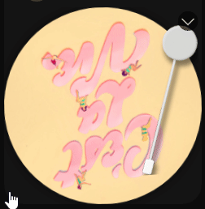
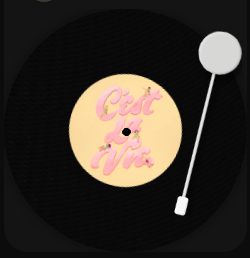

# Vinyl Spotify Theme [INCOMPLETE]

## Normal & Realistic Varients
d
 

## Extensions Used
These Are Extensions That Are Themed Not Required

[Spicetify Genre](https://github.com/Shinyhero36/Spicetify-Genre) By [Shinyhero36](https://github.com/Shinyhero36)

[Spicetify Star Rating](https://github.com/duffey/spotify-star-ratings) By [duffey](https://github.com/duffey)

[Spicetify Playlist Icons](https://github.com/jeroentvb/spicetify-playlist-icons) By [jeroentvb](https://github.com/jeroentvb)

[Spicetify Volume Percentage](https://github.com/daksh2k/Spicetify-stuff) By [daksh2k](https://github.com/daksh2k)

## How To Install The Theme?

In Powershell

```
spicetify config color_scheme dark current_theme vinylspotify
```
